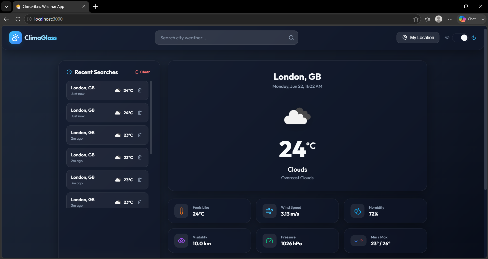
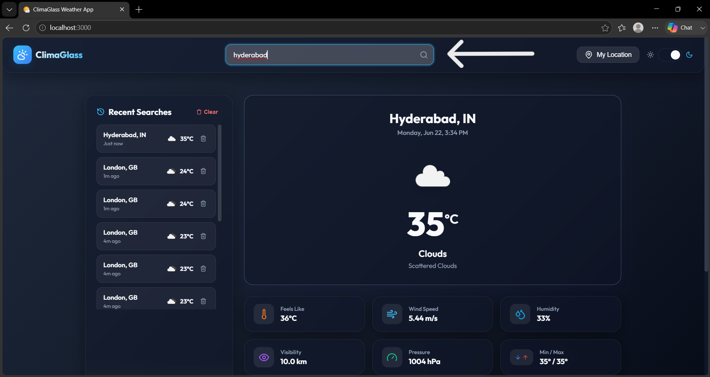
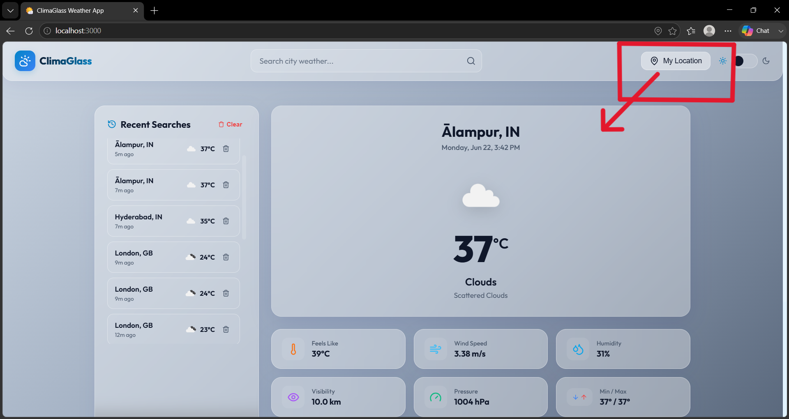
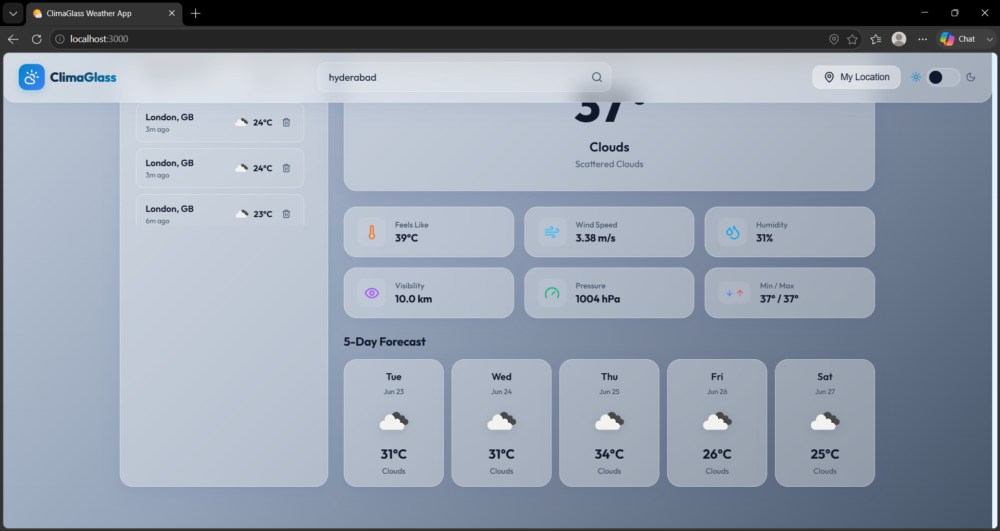
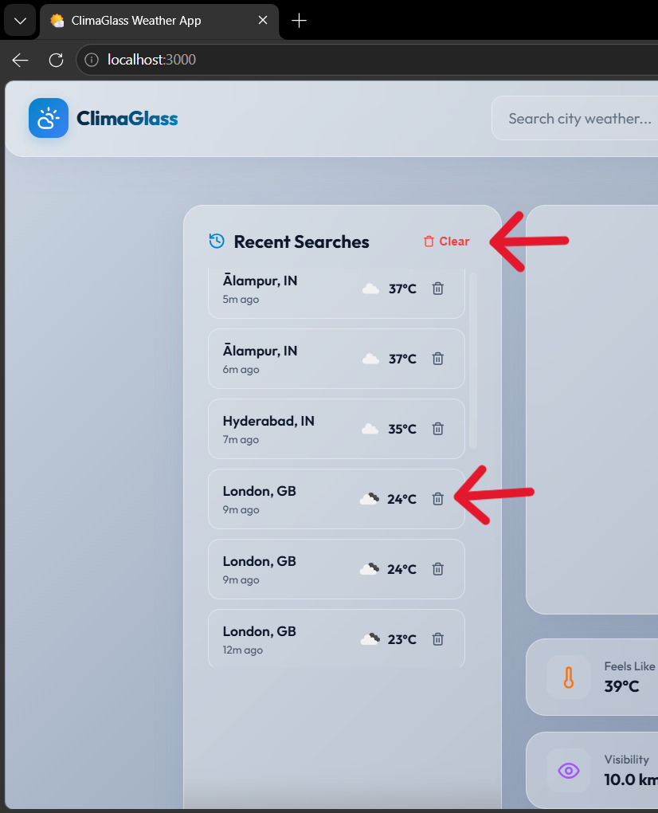

# CLIMAGLASS WEATHER APPLICATION

**COMPANY:** CODTECH IT SOLUTIONS

**NAME:** K.V. NANDAPRIYA

**INTERN ID:** CTIS9805

**DOMAIN:** MERN STACK WEB DEVELOPMENT

**DURATION:** 8 WEEKS

**MENTOR:** NEELA SANTHOSH
 
---
 
## 📝 DESCRIPTION
 
The ClimaGlass Weather Application is a modern, production-ready full-stack web application developed using the **MERN Stack** — MongoDB, Express.js, React.js, and Node.js. The primary objective of this project is to fetch, process, and display real-time weather information by integrating the **OpenWeatherMap API**, while demonstrating practical full-stack web development skills across frontend design, backend architecture, database management, and third-party API consumption. This project was developed as part of the **CODTECH IT Solutions internship program** to showcase the ability to build complete, scalable, and maintainable web applications using industry-standard technologies.
 
The application provides users with an intuitive and fully responsive interface to search for real-time weather information for any city across the globe. When a user enters a city name, the application sends a request to the Express.js backend, which securely communicates with the OpenWeatherMap API using Axios and returns structured weather data to the frontend. The displayed information includes the city name, country, current temperature, feels-like temperature, weather condition, humidity, wind speed, atmospheric pressure, visibility, and dynamic weather icons. This comprehensive data presentation enables users to quickly access accurate, up-to-date weather details for any location worldwide.
 
A key feature of the application is its **five-day weather forecast** functionality. Beyond current conditions, users can view upcoming weather predictions presented through cleanly designed forecast cards, each displaying the date, weather condition icon, condition label, and expected temperature. This feature assists users in planning ahead and understanding anticipated weather patterns. The forecast section is intentionally designed to be simple, responsive, and easy to interpret across all device sizes and screen resolutions.
 
The frontend is built using **React.js with Vite**, offering a fast development environment, optimized build performance, and a smooth user experience. The user interface adopts a modern **glassmorphism design language** — featuring translucent frosted-glass cards, soft shadow layering, backdrop blur effects, and fluid micro-animations. Dynamic weather backgrounds have been implemented to elevate user engagement by automatically adapting the application's visual theme to match current weather conditions, including clear skies, overcast clouds, rainfall, snowfall, thunderstorms, and mist. This visual responsiveness creates an immersive and interactive experience while preserving clarity and usability.
 
The application is fully responsive and carefully optimized for desktop computers, tablets, and mobile devices. Modern CSS techniques, including flexible grid layouts, fluid typography, and adaptive breakpoints, ensure that all components scale and rearrange cleanly across varying screen sizes without compromising functionality or visual quality. Loading animations and structured error handling mechanisms have been integrated throughout to provide meaningful, real-time feedback during API requests. Users receive descriptive error messages whenever an invalid city name is entered, a search fails, or a network issue occurs — ensuring a consistently smooth and frustration-free experience.
 
To further enhance usability, the **Browser Geolocation API** has been integrated into the application. This feature enables users to retrieve weather information for their current physical location with a single button click, removing the need to manually search for nearby cities. The detected GPS coordinates are sent securely to the backend, which resolves the corresponding weather data from the OpenWeatherMap API before returning results to the frontend. This integration highlights the practical use of browser-native APIs in conjunction with a full-stack web application.
 
The application also includes a **dark and light theme toggle** system built using React Context API. Users can switch between a premium glassmorphic dark mode and a clean, high-contrast light mode based on personal preference. Theme selections are persisted in the browser's localStorage, ensuring that the chosen theme is maintained consistently across sessions and page reloads. This feature improves accessibility, demonstrates modern React state management practices, and adds a layer of personalization to the overall user experience.
 
The backend is developed using **Node.js and Express.js** following the MVC (Model-View-Controller) architectural pattern. This approach ensures clear separation between data models, business logic, and routing, resulting in a codebase that is well-organized, maintainable, and easy to extend. All OpenWeatherMap API requests are handled server-side using Axios, keeping the API key fully protected and never exposed to the client. Sensitive configuration values including the API key and database connection string are managed through environment variables using dotenv, following security best practices for production-ready applications.
 
**MongoDB** is used as the database layer to persist city search history. Every successful weather query is automatically recorded in the database with the city name, country, retrieved weather condition, and a timestamp. Users can view their recent searches at any time, instantly re-fetch weather data for previously searched cities with a single click, and manage their history through individual delete or full clear options. This functionality demonstrates practical MongoDB integration, CRUD operations, and Mongoose schema-based data modeling within a real-world MERN stack context.
 
Overall, the ClimaGlass Weather Application successfully unifies frontend development, backend API architecture, database management, third-party API integration, responsive design, and modern user experience principles into a cohesive and complete full-stack solution. The project reflects strong practical knowledge of the MERN stack and demonstrates the ability to design, develop, and deliver scalable, secure, and user-friendly web applications. Through its combination of real-time weather retrieval, five-day forecasting, geolocation support, persistent search history, dynamic theming, and glassmorphism UI design, ClimaGlass fulfills the complete objectives of the CODTECH internship task and stands as a strong, submission-ready portfolio project.
 
---
 
## ✨ FEATURES
 
- 🌡️ Real-time weather data retrieval using OpenWeatherMap API
- 🔍 Weather search by city name with instant results
- 📊 Comprehensive weather information display including temperature, humidity, wind speed, pressure, and visibility
- 📅 5-Day weather forecast with daily condition cards
- 📍 Browser Geolocation support for one-click current location weather
- 🕘 Search history management with timestamps stored in MongoDB
- 🎨 Fully responsive glassmorphism user interface
- 🌈 Dynamic weather backgrounds adapting to current conditions
- ⏳ Loading indicators and structured error handling
- 🔒 Secure backend API proxying with environment variable configuration
- 🏗️ Clean MVC architecture implementation
- 🌙 Dark and Light mode toggle with localStorage persistence
---
 
## 🛠️ TECHNOLOGIES USED
 
### 🎨 Frontend
- ⚛️ React.js (Vite)
- 🔀 React Router DOM
- 🧠 Context API
- 🌐 Axios
- 🎨 CSS3
### ⚙️ Backend
- 🟢 Node.js
- 🚂 Express.js
- 🌐 Axios
### 🗄️ Database
- 🍃 MongoDB
- 📦 Mongoose
### 🔌 API
- ⛅ OpenWeatherMap API
---
 
## 📸 OUTPUT
 
### 1. 🏠 Home Dashboard
 

 
The main dashboard of the ClimaGlass Weather Application displaying current weather information, search functionality, recent searches, and weather statistics in a modern glassmorphism interface.
 
---
 
### 2. 🔍 Weather Search Result
 

 
This screen demonstrates the city-based weather search feature. Users can enter any city name and instantly retrieve real-time weather information including temperature, humidity, wind speed, pressure, and visibility from the OpenWeatherMap API.
 
---
 
### 3. 📍 Current Location Weather
 

 
The application uses the Browser Geolocation API to detect the user's current GPS coordinates and automatically fetch accurate, location-specific weather information with a single click — without requiring manual city entry.
 
---
 
### 4. 📅 Five-Day Weather Forecast
 

 
This section presents the five-day weather forecast in a horizontally scrollable card layout, providing users with daily weather condition icons, labels, and temperature predictions to support effective short-term planning.
 
---
 
### 5. 🕘 Search History Management
 

 
The application automatically stores all successfully searched cities in MongoDB along with their corresponding timestamps. Users can instantly revisit any previous search with a single click and manage stored records using the individual Delete or full Clear History options.
 
---
 
## 🏁 CONCLUSION
 
The ClimaGlass Weather Application successfully demonstrates the end-to-end development of a full-stack MERN application integrated with a live third-party REST API. The project brings together frontend development, backend architecture, database management, API integration, and responsive UI design into a complete, well-structured, and user-friendly solution. Through its implementation of real-time weather retrieval, five-day forecasting, browser geolocation, persistent search history, dynamic theming, and glassmorphism design, the application fully satisfies the objectives of the CODTECH internship task. This project provided meaningful hands-on experience in building scalable web applications and significantly deepened practical understanding of modern full-stack development using the MERN stack.
